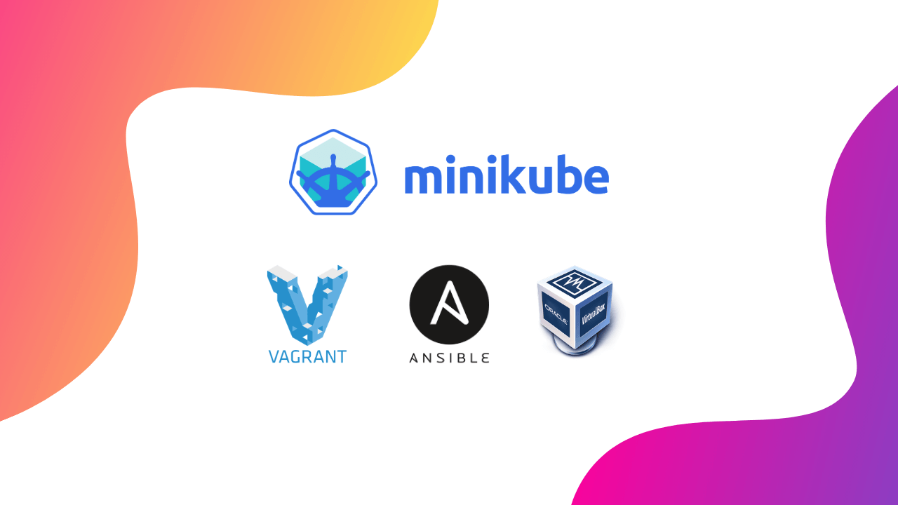

# Installing minikube with Vagrant and Ansible

> __IMPORTANCE NOTE__: Minikube now supports various drivers (including Podman, VirtualBox, Docker, etc.), so I have stopped using Minikube within a Vagrant + VirtualBox VM. As a result, I am no longer maintaining this Vagrant use case folder.

Refer to [minikube](https://www.iamgini.com/minikube) notes for more details.

```shell
## Install minikube
$ curl -LO https://storage.googleapis.com/minikube/releases/latest/minikube-linux-amd64
$ sudo install minikube-linux-amd64 /usr/local/bin/minikube

## Start minikube with virtualbox as driver
$ minikube start --driver=virtualbox

## Get pods if you dont have kubectl or different version of kubectl
$ minikube kubectl -- get pods -A

## Start Kubernetes Dashboard
$ minikube dashboard

## Stop the minikube VM
$ minikube stop
```

## Start Another minikube!

Yes, you can create multiple Kubernetes clusters using minikube but remember to give different name (`--profile`).

```shell
# Start a minikube cluster using Podman as driver.
$ minikube start --profile cluster2-podman --driver=podman

# Stop cluster
$ minikube stop --profile cluster2-podman

# Remove the cluster
$ minikube delete --profile cluster2-podman
```

## Multi-node Kubernetes Cluster using minikube

```shell
$ minikube start --driver=virtualbox --nodes 2

$ kubectl get nodes
NAME           STATUS     ROLES           AGE   VERSION
minikube       Ready      control-plane   95s   v1.26.3
minikube-m02   NotReady   <none>          8s    v1.26.3
```

## NOT in USE: Old method using the Vagrant + VirtualBox

This is a simple repo to demonstrate how to install minikube inside a virtualbox vm using Vagrant and Ansible as provisioner.

Watch **[video](https://www.youtube.com/watch?v=xPLQqHbp9BM&t=2s)** for detailed explanaton.

**Important Note**
If you are planning to other variants of box (ubuntu or debian instead of CentOS), make sure you adjust your Ansible playbook (`install-minikube.yaml`) accordingly.



## How to use this repo - Quick Overview

1. Install Vagrant

2. ~~Install Ansible~~

**Update**
Since some of the users reported that, they are using Windows and unable to use Ansible, I have adjusted the Vagrantfile to use with `ansible_local` option.

3. Clone this repo to your working directory

`git clone git@github.com:ginigangadharan/vagrant-iac-usecases.git`

4. switch to `vagrant-iac-use cases/virtualbox-iac-minikube` directory and run `vagrant up`

## Additional Notes

minikube will be installed and running with default components. If you want to enable additional components add those using `minikube enable` command.

Eg: Enable `metrics-server`

```shell
[vagrant@centos-minikube ~]$ sudo minikube addons enable metrics-server
* The 'metrics-server' addon is enabled
```

## References
- [Installing Kubernetes with Minikube](https://kubernetes.io/docs/setup/learning-environment/minikube/)
- [minikube start](https://minikube.sigs.k8s.io/docs/start/)
- [minikube](https://technology.amis.nl/2019/02/12/rapidly-spinning-up-a-vm-with-ubuntu-docker-and-minikube-using-the-vm-drivernone-option-on-my-windows-laptop-using-vagrant-and-oracle-virtualbox/)